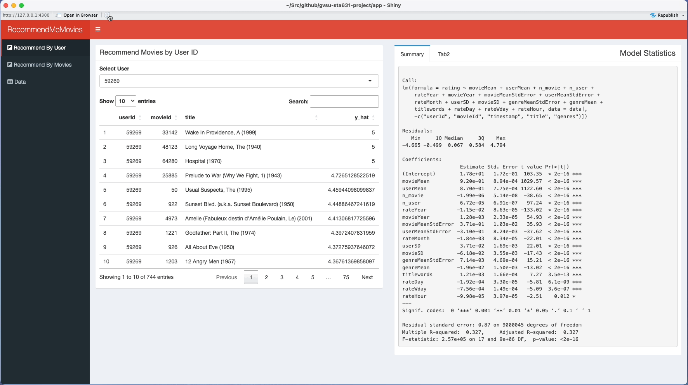

# RecommendMeMovies



A simple shiny app to predict user's rating on the movies they would like to watch.

# Dataset

The Movielens dataset contains the rating data collected from the [MovieLens](https://movielens.org/) website over various period of time.

Link: [MovieLens](https://grouplens.org/datasets/movielens/)

# Setup

To run the shiny app, please follow below steps:

1.  Build docker image:

``` bash
docker compose build
```

2.  Run the app

``` bash
docker compose up -d
```

3.  Launch app in browser using the url: <http://localhost:3000>.
